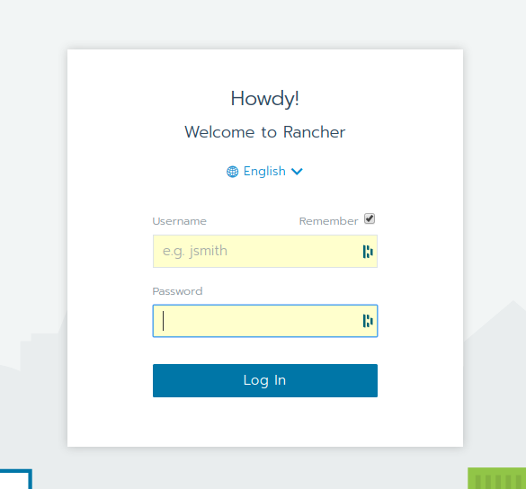
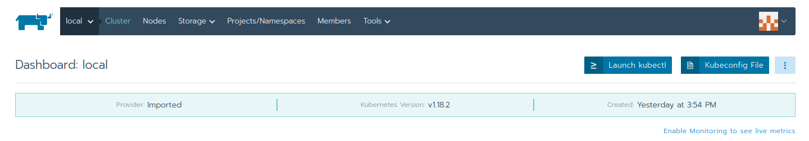
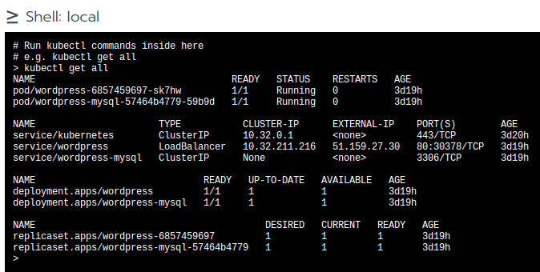

## TP2: Déploiement d'un rancher sur votre cluster Kubernetes

Pour réaliser l'installation du rancher, vous possédez déjà 
un cert manager, vous disposez également d'un issuer pour vos certificats https.

Rendez vous sur la page de documentation de rancher:

> https://rancher.com/docs/rancher/v2.x/en/installation/k8s-install/

Vous pouvez utiliser le helm chart stable pour installer votre rancher.
Attention il n'est pas au même endroit que les chart classiques:

> https://github.com/rancher/rancher/tree/master/chart

Lisez bien le fichier value.yaml, vous devez mettre votre DNS. Utilisez l'entrée
suivante: prénom-rancher.daubichon.com, il y a également de la configuration à faire
afin d'obtenir le https. 

Le fichier values.yaml se trouve ici:

> https://github.com/rancher/rancher/blob/master/chart/values.yaml

Pour cela rendez vous sur la documentation de Rancher ici:

> https://rancher.com/docs/rancher/v2.x/en/installation/k8s-install/helm-rancher/#4-choose-your-ssl-configuration

Rappel: nous avons déjà cert manager, les valeurs que vous voyez dans la commande du helm install
peuvent être transmises en dur dans votre fichier value.yaml (recommandé)

Voici la commande pour installer votre rancher:

helm install --namespace votrenamespace mylab rancher-stable/rancher --version 2.3.5 -f values.yaml

* La version 2.3.5 est la version stable.

Je m'occuperai de réaliser l'enregistrement DNS.

Lorsque l'installation de rancher est terminée vous devriez obtenir ce retour:

L'installation peut prendre un peu de temps, n'hésitez pas à regarder vos nouveaux pods
associés à rancher.

Rendez-vous à l'url indiquée et créez votre login:

Explorez l'interface de rancher et lancez des commandes kubectl depuis votre rancher.

## Créez un nouvel utilisateur

- se rendre sur l'onglet global, puis users et add user.

- créez un standard user

## Ajouter cet utilisateur à votre cluster

- se rendre sur l'onglet local, puis members.

- essayez de lancer une commande kubectl avec ce nouvel utilisateur

> **Les commandes ne devraient pas fonctionner avec cet utilisateur.** 

- Reconnectez vous avec votre utilisateur admin.

- Dans l'onglet local, puis members, supprimez l'utilisateur.

- Ajoutez un nouvel utilisateur, puis custom et ajoutez All Projects. 

- Relancez des commandes kubectl depuis votre rancher connecté avec cet utilisateur.

