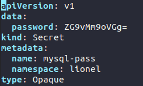
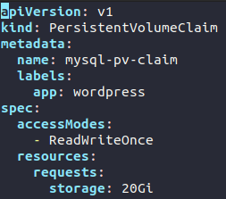
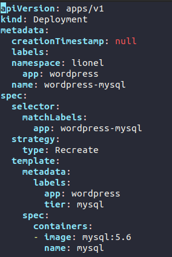
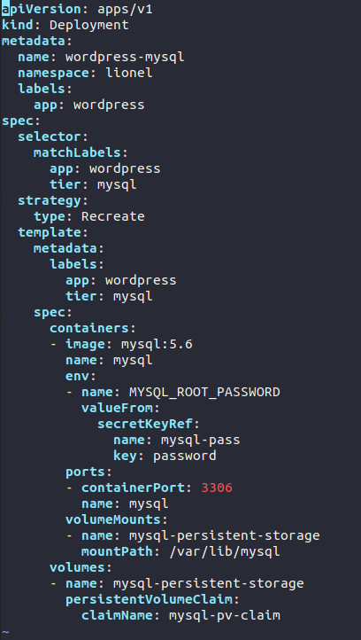
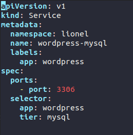
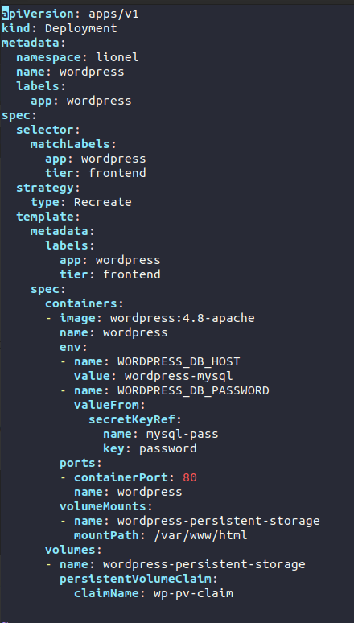
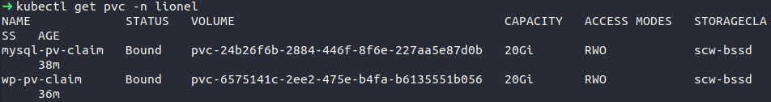
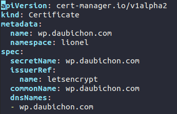

## TP3 Déploiement d'un wordpress avec base de données MySQL

Ce TP fait intervenir ces différentes notions:

 - PersistentVolume
 - VolumeClaim
 - Secret

Le volume persistant va être automatiquement provisionné par scaleway lorsque vous allez déployer votre object kubernetes.

Les Volumes persistants sont indépendants du cycle de vie de vos pods.

Vous allez également aborder la notion de secrets pour stocker votre mot de passe
mysql. 

## Les Etapes 

> Générer un secret pour MySQL
> Créer un volume claim pour mysql
> Générer un déploiement pour votre MySQL
> Créer un service pour votre MySQL
> Générer un déploiement pour votre Wordpress
> Créer un volume claim pour votre Wordpress
> Créer un service pour votre Wordpress
> Appliquer un certificat SSL sur votre Wordpress 

**Etape 1:**

Générer un secret:

Vous pouvez exporter votre commande sous forme de Yaml pour voir ce que la commande ci dessous
ajoute à votre secret.

Puis faire un `kubectl create -f secret.yaml`

Pour rappel:

    kubectl create secret generic password --from-literal=password=votremotdepasse -n votrenamespace --dry-run -o yaml

>Les secrets Kubernetes: https://kubernetes.io/docs/concepts/configuration/secret/

Consultez votre secret via une commande kubectl:

    kubectl get secrets -n lionel

Vous pouvez aussi faire un describe sur votre secret, vous pouvez également créer votre secret à la main,
en revanche cela implique d'encoder le secret en base64 avant. 

**Etape 2:** 

Créer un premier volume ***Persistent Volume Claim***

> https://kubernetes.io/docs/concepts/storage/persistent-volumes/#persistentvolumeclaims

Lors de la création de votre volume, utilisez les paramètres suivants:

* créez le label suivant [app: wordpress]
* Donnez ce nom à votre [Pvolumeclaim name: mysql]
* Donnez un Storage de 20Gi
* Donnez la valeur ReadWriteOnce au paramètre [accessModes: ]

Cette étape va automatiquement provisionner un volume sur ScaleWay

**Etape 3:**

Créer un déploiement MySQL sans réplica. 

    kubectl create deployment wordpress-mysql --image=mysql:5.6 --dry-run -o yaml > wordpress-mysqldeployment.yaml

Votre déploiement n'est pas complet mais vous devriez obtenir un .yaml sensiblement identique:

Dans votre déploiement vous allez avoir besoin de référencer plusieurs éléments:

**1 - Votre secret, créé en étape 1**

**2 - Votre volume claim associé à votre déploiement** 

Ces deux notions se passent au niveau des ***specs*** de votre déploiement. 

Lorsque vous aurez édité votre .**yaml** vous devriez obtenir un résultat similaire à celui-ci:

Faites votre déploiement.

Explication:

 - Dans les specs du container, le paramètre env: va vous permettre d'exporter une valeur depuis votre secret mysql-pass, donc la clé   définissant le mot de passe est "password"

 - Au niveau du container, le parametre volumeMounts permet de définir le volume utilisé (votre volumeclaim) et le path souhaité.

 - Le paramètre volumes va définir quel volumle claim vous allez utiliser. C'est le claimName qui va associer votre volume au pod.

Vous avez désormais un volume, un déploiement et un secret pour votre mysql. 
Vous pouvez vérifier via les commandes kubectl. 

**Etape 4:**

Le service

Créez un service kubernetes qui puisse exposer votre déploiement.

> Pensez à utiliser "selector" et garder le bon label. 

Votre mysql est maintenant déployé dans votre namespace. 
Vous devriez obtenir un résultat similaire:

## Wordpress

**Etape 1**

Créer un second volume persistent volume claim.
Basez vous sur le premier volumclaim pour mysql. 

Vous devriez obtenir ce type de fichier yaml:

**Etape 2**

Créer un déploiement avec l'image wordpress:4.8-apache.
Pensez également à utiliser les bons environnements et volumes dans la définition de votre déploiement. 

Vous devriez obtenir un déploiement identique à celui-ci:

**Etape 3**

Création d'un service. 

Créez un service faisant référence à votre déploiement wordpress.

**Me demander si point de blocage.** 

Aide: 

Vérifiez que vos déploiements ont bien fonctionné avec une commande kubernetes. 
Vous pouvez également effectuer la commande kubectl get pvc pour savoir si vos volumes sont bien lancés. 

Il doivent afficher le status bound:

Faite également une commande kubectl pour explorer votre service.

**Etape 4**

Maintenant que votre déploiement est fonctionnel, vous allez avoir besoin de créer un ingress, afin de router le traffic vers votre service, depuis votre ingress controller. 

Pour ce faire créez un ingress comme vous l'avez fait au **TP1**. 

Si point de blocage me demander. 

**Etape 5**

Générer une demande de certificat. Pour rappel vous avez déjà une autorité de certification sur votre cluster (issuer), il faut donc simplement créer un objet de type **Certificate.** 

Pour cela vous allez avoir besoin d'une entrée DNS, me prévenir afin que je puisse créer l'entrée DNS. 
Celle-ci sera sous le format prénom-wp.daubichon.com

Vous devriez obtenir un yaml de ce type:

Vous devriez maintenant avoir un site wordpress qui tourne sur kubernetes joignable depuis votre DNS ! 

